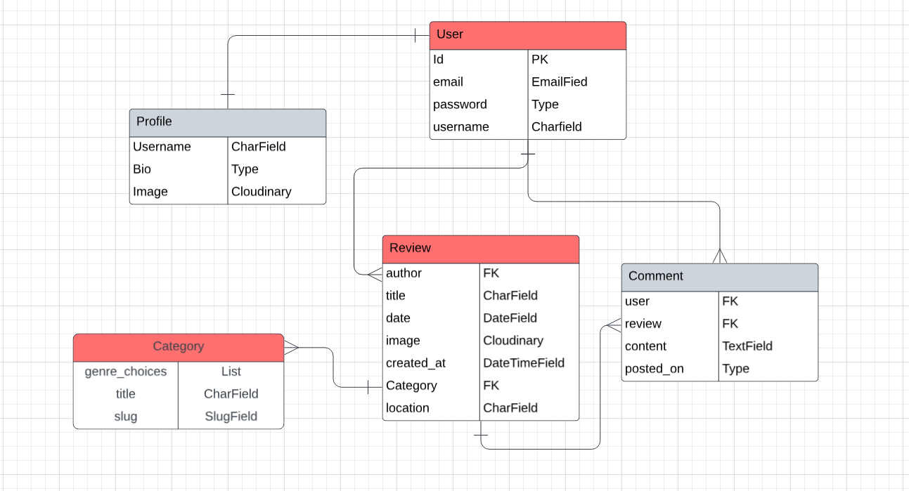

# Stage Score

## Introduction 

**Stage Score** is a live music review blog platform built with Django, featuring full CRUD functionality that allows users to create, read, update, and delete reviews. Users can explore reviews of live gigs, discover insights about their favorite artists, and share their experiences from music events.

The aim of this project is to provide an engaging space for music enthusiasts to celebrate live performances, connect with a like-minded community, and explore a dynamic catalog of gig reviews. Stage Score brings the excitement of live music to the digital world, offering a seamless experience for discovering, discussing, and sharing the magic of the stage.

Developed by //

View live site here: [Stage Score website]()

------

## Table of Contents

- [Project Outline](#project-outline)
- [UX Design](#ux-design)
   - [Colours](#colours)
     - [Colour Palette](#colour-palette)
     - [Contrast](#contrast)
   - [Fonts](#fonts)
   - [Imagery](#imagery)
   - [Favicon](#favicon)
   - [Logo](#logo)
- [User Stories](#user-stories)
   - [Developer](#developer)
   - [New Site Users](#new-site-users)
   - [Registered Users](#registered-users)
   - [Site Admin](#site-admin)
   - [Wireframes](#wireframes)
- [Features](#features)
   - [MVP Features](#mvp-features)
   - [Additional Features](#additional-features)  
   - [Navigation](#navigation)
   - [Pages](#pages)
     - [Page 1](#page-1)
     - [Page 2](#page-2)
     - [Page 3](#page-3)
   - [Footer](#footer)
   - [Responsive Design](#responsive-design)
   - [Future Features](#future-features)
- [Database Design](#database-design)
- [Agile Development Process](#agile-development-process)
   - [MoSCoW Prioritisation](#moscow-prioritisation)
   - [GitHub Projects](#github-projects)
   - [GitHub Issues](#github-issues)
- [Deployment](#deployment)
- [Built With](#built-with)
   - [Technology and Languages](#technology-and-languages)
   - [Libraries and Frameworks](#libraries-and-frameworks)
   - [Tools and Programs](#tools-and-programs)
- [Development](#development)
   - [Ideation](#ideation)
   - [Collaboration Tools](#collaboration-tools)
- [Testing](#testing)
- [Credits](#credits)
    - [Content](#content)
    - [Code](#code)
    - [Media](#media)
    - [Acknowledgements](#acknowledgements)

## Project Outline

### About

Stage Score is a dynamic live music review platform built with Django, designed to celebrate the thrill of live performances and provide a space for music lovers to explore, share, and engage with gig reviews.

The goal of this project is to create an accessible and engaging platform for concertgoers, music enthusiasts, and aspiring reviewers alike. Built with the powerful Django framework, Stage Score combines functionality with user-friendly design to deliver an enjoyable and seamless experience for anyone passionate about live music.

### Problem Statement

Many live music enthusiasts struggle to find a dedicated platform where they can read authentic gig reviews, share their experiences, and discover insights about their favorite artists. While concertgoers often want to relive performances and find recommendations for future gigs, aspiring music reviewers lack a centralized space to showcase their work and connect with a like-minded community. This gap leaves music lovers without a cohesive, community-driven hub to celebrate the magic of live performances.

### Purpose

**Stage Score** aims to solve this problem by offering a vibrant and interactive platform where users can:

- Discover authentic reviews of live music performances across different genres and venues.
- Share their personal gig experiences and opinions with a larger community.
- Explore curated insights about their favorite artists, bands, and events.
- Connect with fellow music lovers who share a passion for live performances.
- Provide a space for aspiring music reviewers to showcase their critiques and build an audience.

By offering these features, Stage Score becomes a hub for celebrating live music, fostering connections, and amplifying the voices of concertgoers and reviewers.

### Target Audience

Stage Score is designed to cater to a wide range of live music enthusiasts, including:
- Concertgoers
   - People who regularly attend gigs and want to share or read experiences about live performances.
- Music Enthusiasts
   - Individuals passionate about live music who are looking for insights and reviews to guide their future concert plans.
- Aspiring Music Reviewers
   - Hobbyists or professionals who want to write detailed gig reviews, share their perspectives, and grow their audience.
- Casual Listeners
   - Fans looking to discover new artists, events, or live music opportunities through credible reviews.
- Artists and Industry Professionals
   - Musicians, bands, and event organizers seeking feedback, exposure, and a way to connect with their audience.

## UX Design

### Colour Scheme

- `#023047` - used as the primary text colour
- `#115170` - used as the background colour for the header and footer
- `#000F16` - used as the secondary text colour
- `#FFFFFF` - used as the primary background colour
- `#E3F2FD` - used as an alternative text colour, for the header and footer background
- `#97FFC9` - used for buttons and icons on the header and footer background
- `#FFE99D` - used for buttons and icons on the header and footer background

We used [Coolors](coolors.co) to generate our colour palette 

#### Contrast

We used Adobe’s Colour contrast checker tool to ensure that the colours met web accessibility standards. We wanted to ensure a minimum colour contrast ratio of 7:1 to meet WCAG’s AAA level colour contrast ratio standards.

For our colours, we achieved the following contrast ratios:

| Purpose                   | Hex Code  | Background | Contrast Ratio | Meets AAA |
|---------------------------|-----------|------------|----------------|-----------|
| Primary Text Color        | #023047   | #FFFFFF    | 13.85:1        | Yes       |
| Secondary Text Color      | #000F16   | #FFFFFF    | 19.45:1        | Yes       |
| Light Accent Background   | #E3F2FD   | #115170    | 7.55:1         | Yes       |
| Primary Button/Icon Color | #97FFC9   | #115170    | 7.17:1         | Yes       |
| Secondary Button/Icon Color| #FFE99D  | #115170    | 7.14:1         | Yes       |

### Fonts

We used ‘Inter’ and ‘Poppins’ as our font choices, and used Google Fonts to import these.

### Imagery

### Favicon

### Logo

We created two logos for our website using [Logo Design AI](https://logodesign.ai/). The first logo is the one that will show on the white background, and the second logo will be used on our header and footer sections.

**Logo 1** 

**Logo 2**

## User Stories

### Developer

- As a developer I can get an idea of the whole design system so that I can work on the UI/UX design effectively. `Must Have`

- As a developer I can implement authentication for admins so that only authorised users can manage events. `Must Have`

### New Site Users

- As a site visitor I can clearly see the website's purpose so that I can decide what features I would like to use. `Must Have`

- As a site visitor I can create an account so that I have access to all the website features. `Must Have`

- As a site visitor/user I can easily navigate the site on any device so that I have a seamless experience whether on desktop or mobile. `Must Have`

- As a first-time visitor I can see a list of popular events so that I can explore gigs without signing up. `Won't Have`

### Registered Users

- As a commenter I can delete my comments so that I can remove opinions I no longer want to be shared. `Should Have`

- As a registered user I can comment on posts so that I can engage in discussions with other users. `Should Have`

- As a registered user I can update my profile information so that other users can identify me. `Should Have`

- As a user I can log in to my account so that I can access personalised features. `Must Have`

- As a user I can log out of my account at any time so that if I want to end my session. `Must Have`

- As a user I can create posts so that I can share my thoughts about different events or artists. `Must Have`

- As a user I can edit any posts / reviews I have made so that I can update any information. `Must Have`

- As a registered user I can view a post’s likes so that I can identify the most captivating posts. `Could Have`

- As a user I can delete my posts so that I can remove content I no longer want to share. `Must Have`

- As a registered user I can click a button icon so that I can like posts or remove the like if I change my mind. `Could Have`

- As a user I can view a post so that I can see all the info about it. `Must Have`

- As a user I can search for events by location so that I can find gigs happening near me. `Could Have`

- As a user I can follow my favourite artists so that I can stay updated on their gigs. `Won't Have`

### Site Admin

- As an admin I can create, read, update and delete posts so that I can manage posts on the websites. `Must Have`

### Wireframes

## Features

### MVP Features

| Feature                         |
|---------------------------------|
| Home Page (Website Purpose)     |
| Update Profile                  |
| User Registration and Login     |
| Admin Post Management           |
| Create, Edit, and Delete Posts/Reviews |
| Secure Admin Access             |
| View Posts                      |
| Log Out                         |
| Responsive Design Experience    |
| Wireframing the Website         |
| Comment on Posts                |

These features directly address the core problem identified: creating a platform for live music lovers to share, explore, and engage with gig reviews.

#### Home Page (Website Purpose)
- **Feature**: Clearly display the website’s purpose and main features.  
- **Problem Solved**: Allows site visitors to quickly understand the value of the platform.

#### User Registration and Login
- **Feature**: User registration and login functionality.  
- **Problem Solved**: Provides personalized access to features like creating posts, commenting, and profile management.

#### Create, Edit, and Delete Posts/Reviews
- **Feature**: CRUD functionality for posts/reviews.  
- **Problem Solved**: Enables users to share and update their thoughts about gigs and events.

#### View Posts
- **Feature**: Ability to view posts and reviews with all relevant details.  
- **Problem Solved**: Gives users access to gig reviews and information shared by others.

#### Responsive Design Experience
- **Feature**: Full responsiveness for seamless navigation on desktop and mobile devices.  
- **Problem Solved**: Ensures accessibility and usability across all devices for all users.

#### Comment on Posts
- **Feature**: Users can leave comments on posts.  
- **Problem Solved**: Promotes discussion and community engagement around shared experiences.

#### Update Profile
- **Feature**: Users can update profile information, such as display name and bio.  
- **Problem Solved**: Enhances personalization and allows users to build an identity on the platform.

#### Admin Post Management
- **Feature**: Admins can create, read, update, and delete posts.  
- **Problem Solved**: Ensures content quality and moderation to maintain platform integrity.

#### Secure Admin Access
- **Feature**: Admin authentication system to restrict unauthorized access.  
- **Problem Solved**: Protects administrative controls from misuse.

#### Log Out
- **Feature**: Users can log out of their account.  
- **Problem Solved**: Ensures privacy and security of user sessions.

#### Wireframing the Website
- **Feature**: Design system planned through wireframes (developer-focused).  
- **Problem Solved**: Provides a visual roadmap for an effective and user-friendly UI/UX design.

### Additional Features

These features enhance the platform and further address user needs, creating a richer and more engaging experience.

| Feature (Iteration 2)                   |
|---------------------------|
| Delete Comments           |
| View Likes on Posts       |
| Like/Unlike Posts         |
| Find Events by Location   |

#### Delete Comments
- **Feature**: Users can delete their own comments.  
- **Problem Solved**: Gives users control over their shared opinions.

#### View Likes on Posts
- **Feature**: Users can see how many likes a post has received.  
- **Problem Solved**: Highlights popular or engaging content for better discovery.

#### Like/Unlike Posts
- **Feature**: Users can like or unlike posts using a button/icon.  
- **Problem Solved**: Allows users to express appreciation for posts and reviews.

#### Find Events by Location
- **Feature**: Search for events based on location (city or venue).  
- **Problem Solved**: Helps users discover gigs relevant to their location.

| Feature (Iteration 3)                   |
|---------------------------|
| Follow Favourite Artists  |
| Explore Popular Events    |

#### Follow Favourite Artists
- **Feature**: Users can follow their favorite artists to stay updated on their gigs.  
- **Problem Solved**: Enhances user engagement and personalizes event discovery.

#### Explore Popular Events
- **Feature**: Display a list of popular events for first-time visitors.  
- **Problem Solved**: Encourages new visitors to explore and engage without signing up immediately.

### Navigation

### Pages

#### Page 1

#### Page 2

#### Page 3

### Footer

### Responsive Design

### Future Features

## Database Design

After initialising the project idea we moved on to creating an Entity Relationship Diagram (ERD). This would act as a visual representation of the database we wanted to implement, covering all the information we would need to store for the project. In addition, the diagram also made the links between each model and how they interact much more clearer. We also refered to this throughout the project to ensure we included all the relevant attributes and didn't miss anything out.

## Agile Development Process

### MoSCoW Prioritisation

### GitHub Projects

### GitHub Issues

## Deployment

## Built With

### Technology and Languages

### Libraries and Frameworks

### Tools and Programs

## Development

### Ideation

### Collaboration Tools

## Testing

## Credits

### Content

### Code

### Media

### Acknowledgements

