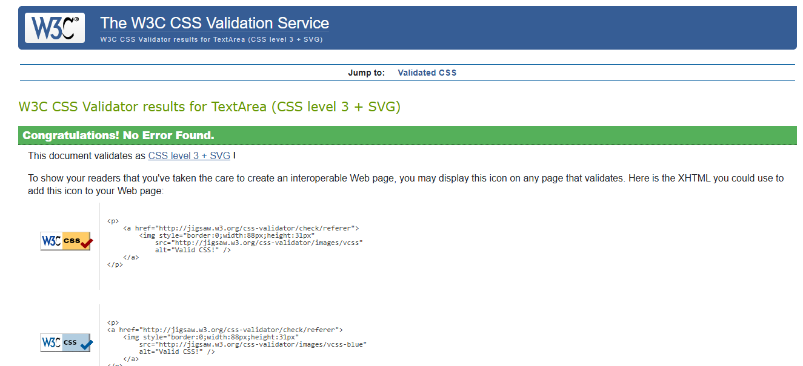

# Testing

This is the TESTING file for the [StageScore](https://) website.

Return back to the [README.md](README.md) file.

## Testing Contents  
  
- [Testing](#testing)
  - [Testing Contents](#testing-contents)
  - [Validation](#validation)
    - [HTML Validation](#html-validation)
    - [JavaScript Validation](#javascript-validation)
    - [Python Validation](#python-validation)
    - [CSS Validation](#css-validation)
    - [Lighthouse Scores](#lighthouse-scores)
    - [Wave Accessibility Evaluation](#wave-accessibility-evaluation)
  - [Manual Testing](#manual-testing)
    - [Browser Compatibility](#browser-compatibility)
    - [Testing User Stories](#testing-user-stories)
    - [Dev Tools/Real World Device Testing](#dev-toolsreal-world-device-testing)
  - [Bugs](#bugs)

## Validation

### HTML Validation

For our HTML files we have used [HTML W3C Validator](https://validator.w3.org) to validate all of our HTML files.

I have had to follow a different approach for validating my HTML for this project as the majority of my pages are developed using Jinja syntax such as '' and '{{ form|crispy }}' and most require user authentication. The HTML validator will throw errors if we use the website's URL, so we have had to follow the below approach for every page:

- Via the deployed Heroku app link, I have navigated to each individual page.
- Right clicking on the screen/CTRL+U/⌘+U on Mac, allows a menu to appear, giving me the option to 'View page source'.
- The complete HTML code for the deployed page will appear, allowing you to select the entire code using CTRL+A/⌘+A on Mac.
- Paste the copied code into the [validate by input](https://validator.w3.org/#validate_by_input) option.
- Check for errors and warnings, fix any issues, revalidate by following the above steps and record the results.

All HTML pages were validated and received a 'xxxxxxxxx' result, as shown above.

| HTML Source Code/Page | Errors | Warnings |
| ---- | ------ | -------- | 
| Home | 0 | 0 |
| Sign In | 0 | 0 |
| Sign Up | 0 | 0 |
| Review | 0 | 0 |
| Add Review | 0 | 0 |
| Review_detail | 0 | 0 |
| Edit Review | 0 | 0 |
| Delete Review | 0 | 0 |
| Delete Comment | 0 | 0 |

| Error 403 | 0 | 0 |
| Error 404 | 0 | 0 |
| Error 500 | 0  | 0 |
  

  

### JavaScript Validation

[JSHint](https://jshint.com/) was used to validate the small amount of JavaScript code added to the project. 

### Python Validation

[CI Python Linter](https://pep8ci.herokuapp.com/#) was used to validate the Python files that were created or edited by myself. No issues presented and line lengths were double checked. I have included some screenshots with the results below.

| Feature | admin.py | forms.py | models.py | urls.py | views.py |
|---------|----------|----------|-----------|---------|----------|
| Review | [no errors](documentation/testing/review_admin.png) | [no errors](documentation/testing/review_forms.png) | [no errors](documentation/testing/review_models.png) | [no errors](documentation/testing/review_urls.png) | [no errors](documentation/testing/review_views.png) |
| Profile  | [no errors](documentation/testing/profile_admin.png) | [no errors](documentation/testing/profile_forms.png) | [no errors](documentation/testing/profile_models.png) | [no errors](documentation/testing/profile_urls.png) | [no errors](documentation/testing/profile_views.png) |
| Stage Score main app | na | na | na | [no errors](documentation/testing/stagescore_urls.png) | na |
| Home | na | na | na | [no errors](documentation/testing/home_urls.png) | [no errors](documentation/testing/home_views.png) |

### CSS Validation 

[W3C CSS Validator](https://jigsaw.w3.org/css-validator/) was used to validate my CSS file.

 